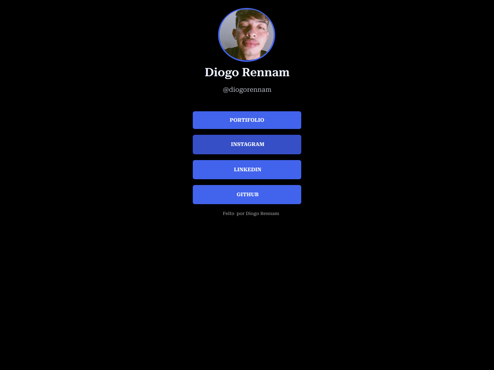

<h1 align="center">  Link_tree </h1>

Mini Curso Primeiro Passos na web.

  <a href="#-tecnologias">Tecnologias</a>&nbsp;&nbsp;&nbsp;|&nbsp;&nbsp;&nbsp;
  <a href="#-projeto">Material</a>&nbsp;&nbsp;&nbsp;|&nbsp;&nbsp;&nbsp;
  <a href="#-layout">Layout</a>&nbsp;&nbsp;&nbsp;|&nbsp;&nbsp;&nbsp;

 

  

## 🚀 Tecnologias

Esse projeto foi desenvolvido com as seguintes tecnologias:

- HTML e CSS
- Git e Github
- Visual studio code

## 💻 Material

Para acessar o material do nosso Mini curso acesse o link: [MATERIAL](https://drive.google.com/drive/folders/1IxCvApyy7kk2FIHWZGuwb4RnlipNzrgI?usp=sharing)

## 🔖 Layout

Você pode visualizar o layout do projeto através [DESSE LINK](https://www.figma.com/community/file/1223782952174124295). É necessário ter conta no [Figma](https://figma.com) para acessá-lo.

---

Feito com ♥ by Diogo e Beatriz  [Participe da nossa comunidade girls!](https://www.instagram.com/girls.intech/)
